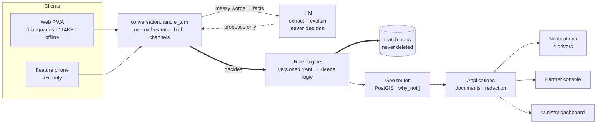

# SETU — architecture

> AI understands the citizen. Rules decide eligibility. Data routes the citizen.
> Evidence explains the decision.

---

## The decision path



**The double line is the decision path. The dotted line is everything a model may do.**
That distinction is the architecture; everything else is implementation.

## Layers

| Layer | Technology | Responsibility |
|---|---|---|
| `apps/web` | Next.js 14 App Router, Tailwind, next-intl | Citizen PWA, staff consoles, demo surfaces |
| `apps/api` | FastAPI 3.11, SQLAlchemy 2.0 async, Pydantic v2 | HTTP surface, orchestration, persistence, audit |
| `packages/rules` | Python + TypeScript, YAML rule data | Eligibility, ranking, next-question, document checklist |
| Data | PostgreSQL 16 + PostGIS + pgvector | Schemes, partners, citizens, applications, audit |
| Cache | Redis | Conversation sessions, routing cache, rate-limit windows |

## Load-bearing decisions

### The rule engine is a package, not a service
It is pure, has no I/O, and is imported by the API. A network hop would add failure modes
to the one component that must never fail, and buys nothing — there is no independent
scaling story for a function that returns in microseconds. See
`docs/adr/0001-rules-not-llm-for-eligibility.md`.

### The engine exists twice, and they are tested against each other
Python is authoritative. TypeScript compiles from the same YAML into `dist/rules.json`
and is checked by a conformance suite. The second implementation exists so the citizen
app could evaluate offline; the conformance test exists so the two can never drift.

### Three-valued logic
`TRUE` / `FALSE` / `UNKNOWN`, and `bool(UNKNOWN)` **raises**. An unknown field cannot
collapse into a rejection by accident — the type system refuses. A hard-block rule that
is UNKNOWN produces `NEED_MORE_INFO` and the single next question worth asking.

### A whitelisted AST evaluator, never `eval`
Rule conditions are expressions in the scheme YAML. They are compiled at load time
against a whitelist of node types and known field names, so a typo is a **load-time
error** rather than a document silently dropped from a citizen's checklist.

### Authorisation is a `WHERE` clause
Every partner-side query filters on the signed-in user's `partner_id`. A forgotten `if`
widens a result set silently; a forgotten join returns nothing and is noticed
immediately. We chose the shape whose failure mode is visible.

### The audit belongs with the decision
`PARTNERS_ROUTED` is written by `routing.find_partners`, not by the HTTP route. It lived
in the route once, and the demo seeder — which calls the service directly — made the
ministry dashboard report "shown a partner: 0" beside 39 applications. An audit record
belongs with the decision, not with one of its callers.

### Caching is allowed to be stale, except where it is not
Routing results are cached in Redis for 600 s, keyed by geohash cell and amount band. A
partner capacity change **invalidates the whole routing cache** — the point of the toggle
is that the next citizen sees it. Eligibility responses are never cached client-side; a
stale verdict is worse than none.

### Fail open, or fail closed, decided per subsystem

| Subsystem | Behaviour on failure | Why |
|---|---|---|
| LLM | Fail open — templates | Eligibility does not depend on it |
| Redis (rate limit) | Fail open — serve | A cache outage must not become an eligibility outage |
| Redis (session) | Fail open — new session | Losing context costs one retyped answer |
| Notification | Fail open — record and log | A message must not roll back an application |
| Document redaction | **Fail closed — refuse** | Losing an upload is recoverable; leaking an Aadhaar is not |
| Illegal state transition | **Fail closed — 409** | The lifecycle is a model, not a log |

## Request lifecycle

```
Client
  → RequestContextMiddleware   assign/adopt X-Request-ID, start timer
  → RateLimitMiddleware        fixed window per group, fails open
  → CORS
  → Route                      Pydantic validation
  → Service                    business logic, audit write
  → packages/rules             pure evaluation
  → SQLAlchemy                 async, parameter-bound
  ← errors.install             global boundary — never leaks a traceback
  ← X-Request-ID on the response and in every error body
```

## Data model — 13 tables

```
consents ──< citizens ──< citizen_profiles
                │
                ├──< applications ──< documents
                │         │
                │         └──< notifications
                │
                └──< match_runs          (never deleted — the reproducibility record)

schemes ──< scheme_rules
   │
   └──< partner_scheme_authorisations >── channel_partners ──< users (role=PARTNER)

audit_log                                (append-only)
```

**`citizens.consent_id` is `NOT NULL`.** There is no code path that stores citizen data
without a consent row to point at — the database refuses it rather than trusting the
application to have remembered.

**`citizens.gov_id_last4` carries `CHECK (~ '^[0-9]{4}$')`.** A full Aadhaar number is
unstorable at the schema level.

## Where things extend

| Change | What you touch | What you do not |
|---|---|---|
| Add a scheme | One YAML file, bump `ENGINE_VERSION`, regenerate golden | No code |
| Change a threshold | The YAML value, bump version, re-run golden tests | No code, no deploy |
| Add a language | A message catalogue, a rules translation bundle | No code |
| Add a notification channel | One class satisfying `Driver` | No call sites |
| Real partner data | Replace the seeder's source | No routing changes |
| NIC / Parichay SSO | `POST /api/v1/auth/login` | Nothing else — the API only asks "who is calling" |
| Object storage for documents | `services/storage.py`, four functions | No routes |

## Deviations from the reference structure

The specification sketches `apps/citizen`, `apps/partner-console`, `apps/admin-console`,
`services/api`, and split `packages/conversation`, `packages/i18n`, `packages/schemas`.
This repository keeps one web app and one API service.

**Reason.** The three surfaces already share a layout, a design system, an API client and
a build. Splitting them into three deployables would triple the build and config surface
to separate three route trees that no one deploys independently — and the spec's own
guidance is to avoid unnecessary microservices and prefer incremental improvement over
rewriting working architecture.

**The separation that mattered is enforced structurally instead.** The citizen surface
lives under `[locale]` with locale routing, an i18n key-parity gate and a 200 KB JS
budget. The staff consoles live under `/console` and the demo surfaces under `/demo`,
both outside that tree, excluded from locale middleware and exempt from the citizen
copy checks — so a console dependency cannot end up in a citizen bundle.

**Tradeoff accepted.** If the consoles ever need independent deploy cadence or a separate
security boundary, this is the seam to split on, and the route trees are already
partitioned along it.
