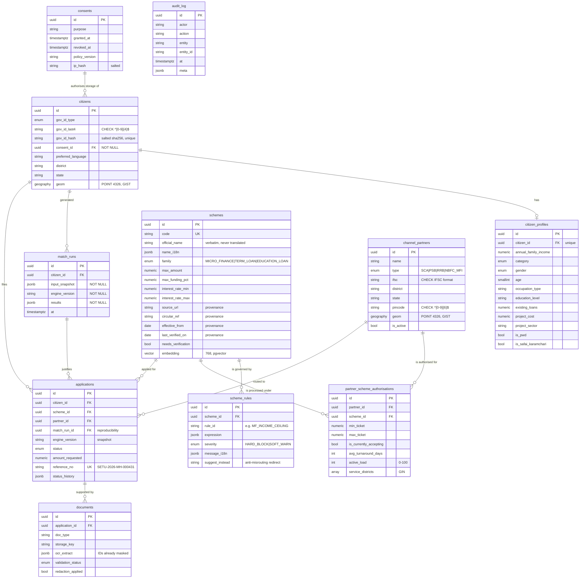

# Data model (Phase 0)

11 tables, 127 columns, 11 foreign keys, 21 indexes, 12 CHECK constraints.
Defined in `apps/api/app/models/`, migrated by `apps/api/alembic/versions/20260828_0001_initial_schema.py`.

## Why the schema looks like this

**Consent is structural, not procedural.** `citizens.consent_id` is `NOT NULL` with
`ON DELETE RESTRICT`. There is no code path that stores a citizen without a consent row,
because the database will not accept one.

**A full government ID is unstorable.** The column is `VARCHAR(4)` *and* carries a
`CHECK (~ '^[0-9]{4}$')`. Even a bug that tries to write a full Aadhaar number fails at
the database. Only the last 4 digits plus a salted hash are retained (DPDP Act 2023).

**Provenance is columns, not comments.** `schemes` carries `source_url`, `circular_ref`,
`effective_from`, `last_verified_on`, and `needs_verification`. A figure the problem
statement does not state cannot be recorded as though it were sourced.

**`match_runs` is the governance artefact.** Every eligibility decision writes the input
snapshot, the engine version, and the full result set. Rows are never deleted, and
`applications` snapshots `match_run_id` + `engine_version`, so a sanction can be replayed
against the exact rules that were live when the citizen applied — even after the YAML
changes. This is the evidence behind "the LLM never decides eligibility".

**Authorisation is a table, not a flag.** A partner is routable for a scheme only if a
`partner_scheme_authorisations` row exists. A missing row is what the routing engine
reports as `why_not` — the anti-misrouting feature — and the GIN index on
`service_districts` plus the GIST index on `channel_partners.geom` make that filter and
the distance sort fast enough to run on every request.

## Enum types

| Type | Values |
|---|---|
| `scheme_family` | MICRO_FINANCE, TERM_LOAN, EDUCATION_LOAN |
| `rule_severity` | HARD_BLOCK, SOFT_WARN |
| `partner_type` | SCA, PSB, RRB, NBFC_MFI |
| `application_status` | DRAFT, SUBMITTED, PARTNER_ACKNOWLEDGED, DOCS_REQUESTED, UNDER_APPRAISAL, SANCTIONED, DISBURSED, REJECTED, WITHDRAWN |
| `document_validation_status` | PENDING, PASSED, WARNING, FAILED |
| `gov_id_type` | AADHAAR, PAN, VOTER_ID, OTHER |
| `social_category` | SC, ST, OBC, GENERAL |
| `gender` | FEMALE, MALE, OTHER, UNDISCLOSED |
