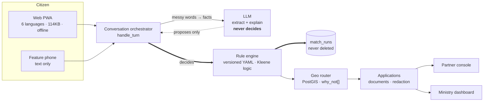

# SETU — pitch outline

Ten slides. Every number on them is queryable from the running system; where a figure is
synthetic or unverified it says so on the slide, not in a footnote.

---

## 1 — The problem, in one number

> **2,216 wrong-counter outcomes prevented across 39 citizens.**

A Scheduled Caste entrepreneur cannot answer two questions:

1. Which government credit scheme actually fits me?
2. Which of the 100+ Channel Partners near me is authorised to process **that** scheme?

So they guess. They walk into the wrong branch. The application is misrouted or delayed,
and the discouragement is permanent — nobody queues twice.

*Speaker note: this is the ministry's own framing in PS 26092, not ours. The core pain
named there is "confusion between schemes plus inability to locate the nearest partner
authorised for that specific loan category."*

---

## 2 — Today's journey vs ours

| | Today | With SETU |
|---|---|---|
| Which scheme? | Ask a neighbour, or a Google result about a different state | Deterministic rule engine, verdict in ~4 questions |
| Why that scheme? | No reason given | `matched_because[]` with rule IDs and source URLs |
| Which branch? | Nearest bank, hope for the best | Ranked, hard-filtered to partners *authorised for that scheme at that ticket size* |
| Why not that branch? | Found out at the counter | `why_not[]` — the exact rule that excludes each nearby branch |
| What do I bring? | A generic list of everything | Narrowed by scheme, partner type and the facts given, with a reason per document |
| In my language? | Hindi or English | Six languages, and a feature-phone channel that needs no app |

---

## 3 — Architecture



The double line is the decision path. The dotted line is everything a model may do.

*Speaker note: swapping the model provider is a config change — anthropic, xAI, Groq, or
`none`. `none` is a fully supported configuration, not a degraded one.*

---

## 4 — The governance angle: the LLM never decides

This is the slide that separates a pilotable system from a hackathon chatbot.

- A deterministic, versioned rule engine decides. Same profile + same rules = byte-identical output, every time.
- Every verdict carries `engine_version`, a `rules_digest`, and the rule IDs that fired.
- Every scheme figure carries `source_url`, `circular_ref`, `effective_from`, `last_verified_on` — and `needs_verification: true` where we could not cite one.
- Every decision is written to `match_runs`, which is never deleted, so a sanction is replayable against the rules that were live when the citizen applied.
- **The rules change next April?** Edit YAML, bump the version, re-run the golden tests. No code deploy.

**Proof, live:** `make chaos` points the service at a model endpoint that does not exist
and runs a full journey. Same scheme, same verdict, same rules in the same order, same
digest. *Byte-identical, because no model was ever involved in deciding.*

---

## 5 — The anti-misrouting screen

The single clearest evidence that we solved the *stated* problem rather than building a
scheme chatbot.

> **Nearby, but cannot help**
> *Bank of Maharashtra, Nagpur — is 4.2 km away but is not authorised for the Micro Finance Scheme.*
> *Fusion Micro Finance, Nagpur — is 9.5 km away but has paused new applications because its capacity is exhausted.*

Every excluded branch names the rule that excluded it. And it works in the other
direction too: Ramesh asks about Micro Finance with a Rs 12 lakh project, and the engine
tells him it does not fit **and names the Term Loan instead** — before he goes anywhere.

*Speaker note: the capacity toggle is a live demo. Pause intake in the partner console,
refresh the citizen's search, the branch is gone with a stated reason.*

---

## 6 — The insight the ministry does not currently have

**Underserved districts** — where citizens ran an eligibility check and no authorised,
accepting partner can process what they matched.

| District | Demand | Partners | Families unserved |
|---|---|---|---|
| Lucknow, UP | 4 | 7 | Educational Loan |
| Nagpur, MH | 4 | 6 | Educational Loan |
| Kolkata, WB | 3 | 2 | Educational Loan |

Seven partners in Lucknow and **not one** can process an Educational Loan.

Demand is measured from **eligibility checks, not applications** — deliberately. The
citizens who matter most are the ones who looked, found nothing, and never applied, so
they never appear in an application table at all.

This is a procurement instrument, not a chart. It says where to authorise the next partner.

---

## 7 — Impact metrics, and what we would be measured on

| Metric | Now (seeded) | Why it is the right metric |
|---|---|---|
| **Misrouting prevented** | 2,216 / 39 citizens | The stated problem, counted directly |
| Wrong-scheme redirects | 39 | Caught upstream of the branch entirely |
| Time to a verdict | ~4 questions | Against an afternoon and a bus fare |
| Districts with a coverage gap | 3 of 10 | Actionable, not descriptive |
| Languages served | 6 | 2 human-reviewed; the rest labelled `draft` on screen |
| Works with the model offline | yes | Verified by `make chaos` in CI-style |

*Stated plainly: partner data is synthetic pending the official MoSJE master, so these are
shape-of-the-answer numbers, not field results.*

---

## 8 — Scale and deployment path

- **Runs today:** `docker compose up` → healthy stack in 37 seconds from destroyed volumes. Postgres 16 + PostGIS + pgvector, Redis, FastAPI, Next.js.
- **Deploys as:** web on Vercel, API + Postgres on Render/Railway; configs are in the repo.
- **Scales on:** the routing query is a single PostGIS `ST_Distance` over a GIST index; the rule engine is pure and cacheable; sessions are in Redis, so the API is stateless.
- **Integrates by:** replacing the seeded partner registry with the ministry's master, and `/api/v1/auth/login` with NIC / Parichay SSO. Nothing else in the API asks anything but "who is calling".
- **Costs:** one small API instance, one Postgres, one Redis. The model is optional and the service is fully functional without it.

---

## 9 — Roadmap, and what we have deliberately not done

**Next**

1. Replace synthetic partners with the MoSJE master; cite the scheme circular numbers (OI-3).
2. Human review of the four draft languages and the console chrome (OI-4, OI-33, OI-35).
3. A delivery number under its own consent purpose, so notifications can leave the building (OI-43).
4. Field-test OCR on real photographs; today it is proved on rendered cards (OI-32).

**Deliberately not done**

- No loan approval. SETU matches and routes; a Channel Partner decides, and every screen says so.
- No full Aadhaar, anywhere. Last four digits plus a salted hash, enforced by a database CHECK — which is why SMS cannot send yet, and we would rather say that than store the number.
- No eligibility figure without provenance. Where we could not find a source, the response carries `needs_verification: true` and the UI badges it.

*47 open items are tracked in `docs/OPEN_ITEMS.md`, open ones first. We would rather show
you that list than have you find it.*

---

## 10 — Team and how to check our work

**Everything on these slides is reproducible in two commands.**

```bash
docker compose up -d && make demo
```

| Check | Command |
|---|---|
| The whole test suite | `make test` — 338 API, 116 rules, 46 TypeScript |
| The Aadhaar redaction proof | `docker compose exec api python -m pytest tests/test_redaction.py -v` |
| Graceful degradation | `make chaos` |
| Python ≡ TypeScript rule engine | `pnpm --filter @setu/rules test` |
| Accessibility and JS budget | `pnpm --filter @setu/web check` |

Built for Smart India Hackathon 2026, Problem Statement 26092, Ministry of Social Justice
& Empowerment.
